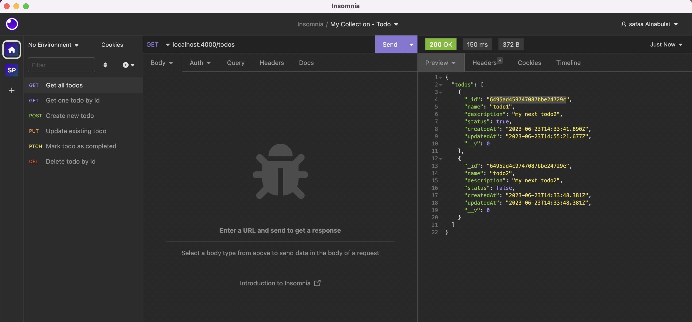

# Todo API

A simple example of a RESTful API that handles TODO list of items. It's built using TypeScript, expressjs and mongoosejs.

## Prerequisites

- [Yarn](https://yarnpkg.com/) installed on your machine.
- [MongoDB](https://www.mongodb.com/) account so you can create a mongodb cluster `clustertodo` and a user.
- [PostMan](https://www.getpostman.com/) or [Insomnia](https://insomnia.rest/) or simply `curl` to invoke the API endpoints.

## Installation

1. Clone the repository: `git clone git@github.com:safaa-alnabulsi/todo-api.git`
2. Install the application: `yarn install`
3. Place your own MongoDB User credentials in `nodemon.json`

```json
{
  "env": {
    "MONGO_USER": "<Username>",
    "MONGO_PASSWORD": "<password>",
    "MONGO_DB": "clustertodo"
  }
}
```

4. Build the project and start the server: `yarn build && yarn start`
5. Open Insmonia and make a `GET` request to `http://localhost:4000/todos/`. It will like the image below after you add your endpoints and couple of todos:



## Endpoints

| Method   | End-Point    | Description                         |
| -------- | ------------ | ----------------------------------- |
| `GET`    | `/todos`     | List all _todos_                    |
| `POST`   | `/todos`     | Create a new _todo_                 |
| `GET`    | `/todos/:id` | Fetch a specific _todo_             |
| `PUT`    | `/todos/:id` | Edit existing _todo_                |
| `PATCH`  | `/todos/:id` | Mark an existing _todo_ as complete |
| `DELETE` | `/todos/:id` | Delete existing _todo_              |

## References

- mongoose: https://mongoosejs.com/
- express: https://expressjs.com
- supertest: https://yarnpkg.com/package/supertest
